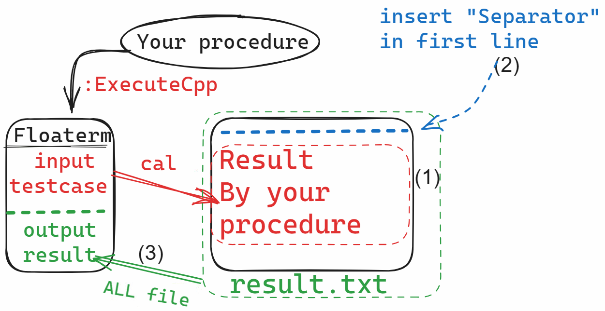
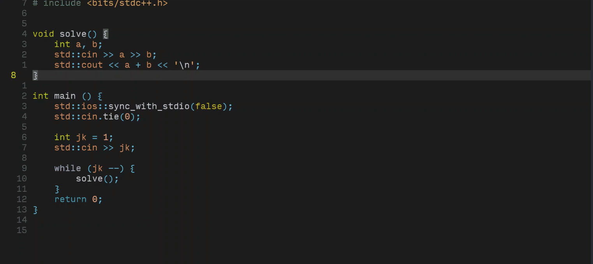
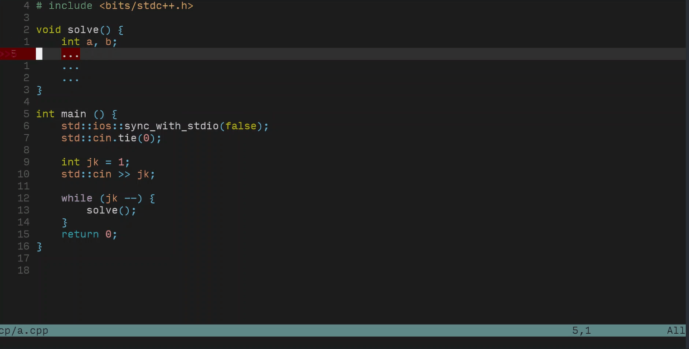
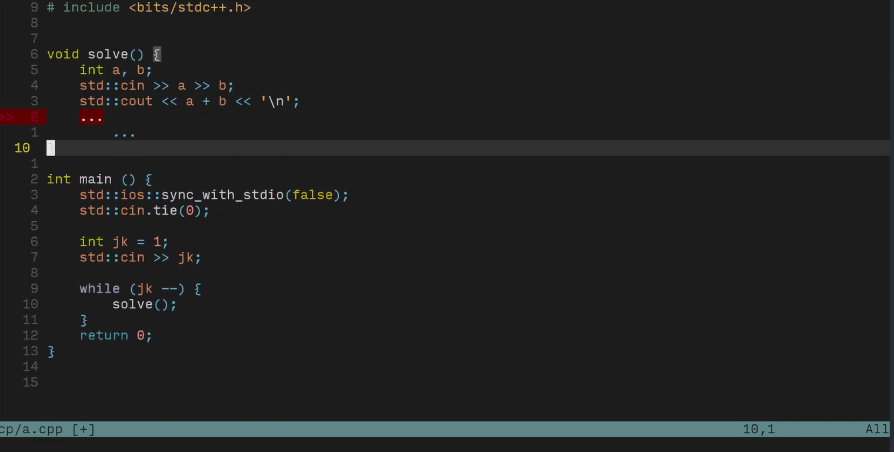
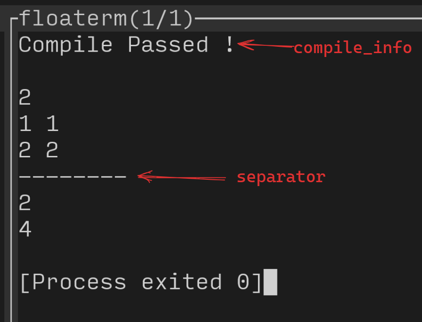
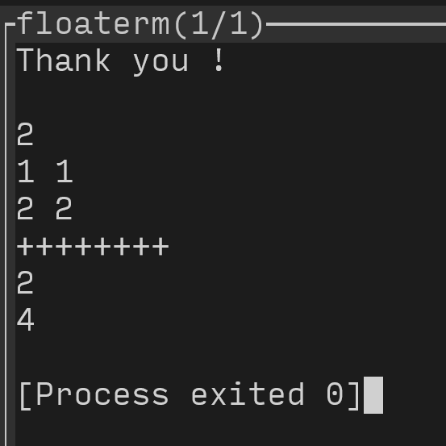
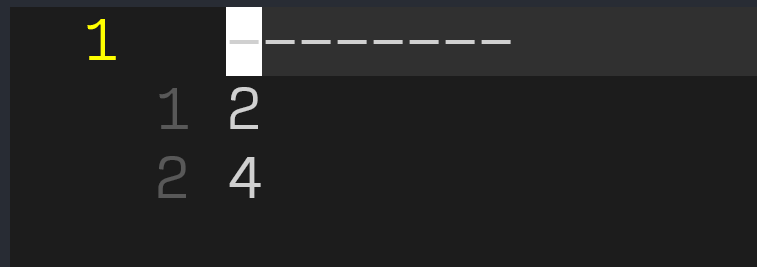

# CONTENTS

- [Idea](##Idea)

- [Features](##Features)

- [GifShow](##GifShow)

- [Requirements](##Requirements)

- [QuickStart](##QuickStart)

- [Usage](##Usage)

- [Customize](##Customize)

## Idea



## Features

- Competitive Programming **whitout mouse operations**.
- Smoothly execute testcases.
- Initialize files with cursor jumps.
- Customizable.

## GifShow

### run testcase


### import template with cursor jump


### compile error infomation


## Requirements

❗❗❗make sure **[voldikss/vim-floaterm](https://github.com/voldikss/vim-floaterm)** is working❗❗❗

packer.nvim：`use 'voldikss/vim-floaterm'`

## QuickStart

### download
- packer.nvim：
`use 'eash-d/CPHelper.nvim'`

### set
- init.lua:
```lua
require("CPHelper").setup({
    result_path = "~/result",                   -- !!! change to your path
    init_file_path = "~/cp/template/init.cpp",  -- !!! change to your path
    cpp_std = "c++17",                          -- !!! change to your c++ version
})
```

## Usage

### run testcases
    `:ExecuteCpp` --> run testcases with cpp.

### init file
    `:InitFile` --> import your template.

### key map
    For those two command, you can key map them. Personally, in keymap.lua:
    vim.keymap.set("n", "<CR>", ":ExecuteCpp<CR>", {remap=True})
    vim.keymap.set("n", "<BS>", ":InitFile<CR>", {remap=True})

    As my habit, I can press "Enter"(<CR>) to run testcase, and press "Backspace"(<BS>)  to import my template code. 

## Customize

### default setup

```lua
require("CPHelper").setup({
    compile_info = "'Compile Passed !'",
    separator = "'1i --------'",
    result_path = "~/result",
    init_file_path = "~/cp/template/init.cpp",
    ft_height = "0.999",
    ft_width = "0.4",
    ft_position = "right",
    cpp_std = "c++17",
    cursor_row = 0,
    cursor_col = 0,
})
```

### details

#### compile_info/separator
```lua
require("CPHelper").setup({
    compile_info = "'Compile Passed !'",
    separator = "'1i --------'",
})
```

```lua
require("CPHelper").setup({
    compile_info = "'Thank you !'",
    separator = "'1i ++++++++'",
})
```


#### result_path = "~/path/to/save/result"❗
    Save result of your procedure in `~/path/to/save/result` for display.
    Make sure you have PERMISSION to accsee the path.
An example which the content in result:


#### ft_height/width/position
Refer to [floatrem options](https://github.com/voldikss/vim-floaterm#gfloaterm_width)

#### cpp_std = "c++17"❗
    Compile options `-std=c++17`. 

#### init_file_path="~/cp/template/init.cpp"❗
    Path to your initial template.

#### cursor_row/col
    When you import  your initial template, the POSITION of cursor. When you had a really LONG head, that's useful.
    `cursor_row = 5`: when you initialize file, CURSOR will be in 5th row.


## TBD
- Video Tutorial
- More language support